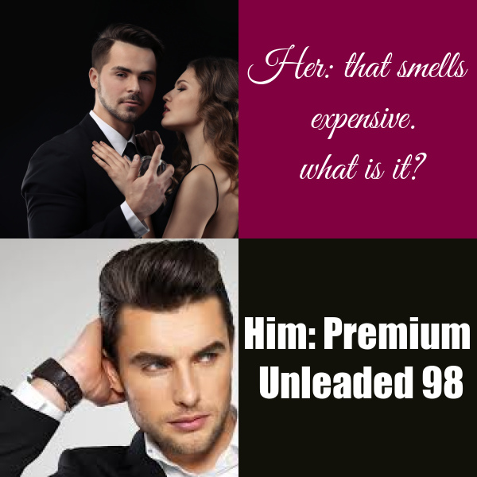

# Inspirations
*I use this code(meme) to make fun of the expensive petrol price recently. This meme is created with [{magick}](https://cran.r-project.org/web/packages/magick/vignettes/intro.html)*

## Innovations
I used different fonts and pictures to express this emotion more dramatically compared with the original memes.:mask:
- **[male and female together](https://filmdaily.co/wp-content/uploads/2021/07/perfumes-lede.jpg)**
- **[only male](https://encrypted-tbn0.gstatic.com/images?q=tbn:ANd9GcTQKSv0uJIQqh3mjA-iznOZ4YtQt2MG7yEqQw&usqp=CAU)**
```r
library(magick)

imageleft1<-image_scale(image_read("https://filmdaily.co/wp-content/uploads/2021/07/perfumes-lede.jpg"),"x300")
imageleft1<-image_crop(imageleft1,"300x300+50")
top<-c(imageleft1,image_blank(width = 300,
                         height = 300,
                         color = "#800040")%>%
  image_annotate(text = "Her: that smells\n expensive.\n what is it?",
                 color = "#ffffff",
                 size = 50, 
                 gravity = "center",
                 font = "Great Vibes"))%>%
  image_append()
imageleft2<-image_scale(image_read("https://encrypted-tbn0.gstatic.com/images?q=tbn:ANd9GcTQKSv0uJIQqh3mjA-iznOZ4YtQt2MG7yEqQw&usqp=CAU"),"x300")
imageleft2<-image_crop(imageleft2,"300x300")
bottom<-c(imageleft2,image_blank(width = 300,
                              height = 300,
                              color = "#111109")%>%
         image_annotate(text = "Him: Premium\n Unleaded 98",
                        color = "#ffffff",
                        size = 50, 
                        gravity = "center",
                        font = "Impact"))%>%
  image_append()
result<-image_append(c(top,bottom),stack = TRUE)
image_write(result, "my_meme.png")
```
The final image is 
