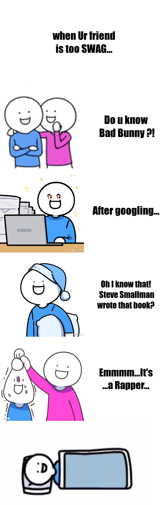

## Welcome to Hannah Jiang's Home Page !!!!!:raising_hand:
# *I will use this repo for demonstrating various code things.*


### Assignment 5 meme
**I create this meme to reflect a interesting thing happened in my life combined with apple_data of assignment5 and data from assignment3**


```r
library(tidyverse)
library(jsonlite)
library(magick)
#read data from Google books API 
#redemption mark
#mark lost in assignment3. Should use intitle not only q in query
query <- "https://www.googleapis.com/books/v1/volumes?q=intitle:%22bad%20bunny%22&maxResults=10"

response <- fromJSON(query, flatten = TRUE)

book_data <- response$items

knitr::kable(select(book_data, volumeInfo.title,volumeInfo.publishedDate))
author<-book_data$volumeInfo.authors[1]
#apple data
name<-apple_data$artist_name[5]
#combine data together to make meme
top1<-image_blank(width = 800,
                  height = 400,
                  color = "#ffffff")%>%
  image_annotate(text = "when Ur friend\nis too SWAG...",
                 color = "#000000",
                 size = 50, 
                 gravity = "center",
                 font = "Impact")
imageleft1<-image_scale(image_read("https://pic3.zhimg.com/80/v2-a83bb7e9b1ed6b8601c9bc43707b5a05_1440w.jpg?source=1940ef5c"),"x400")
imageleft1<-image_crop(imageleft1,"400x400")
top<-c(imageleft1,image_blank(width = 400,
                              height = 400,
                              color = "#ffffff")%>%
         image_annotate(text = paste("Do u know\n",name,"?!",sep=" "),
                        color = "#000000",
                        size = 50, 
                        gravity = "center",
                        font = "Impact"))%>%
  image_append()
bottom1_left<-image_scale(image_read("https://wx4.sinaimg.cn/mw690/0074MxXmly1h1zn1gl7pzj30u00u0mzo.jpg"),"x400")
bottom1_left<-image_crop(bottom1_left,"400x400")
bottom1<-c(bottom1_left, image_blank(width = 400,
                  height = 400,
                  color = "#ffffff")%>%
  image_annotate(text = "After googling...",
                 color = "#000000",
                 size = 50, 
                 gravity = "center",
                 font = "Impact"))%>%
  image_append()
imageleft2<-image_scale(image_read("https://wx3.sinaimg.cn/large/0076Zgehgy1gwmkt4tzarj30u00u0tb6.jpg"),"x400")
imageleft2<-image_crop(imageleft2,"400x400")
bottom<-c(imageleft2,image_blank(width = 400,
                                 height = 400,
                                 color = "#ffffff")%>%
            image_annotate(text = paste("Oh I know that!\n ",author,
                                        "\nwrote that book?",sep=" "),
                           color = "#000000",
                           size = 40, 
                           gravity = "center",
                           font = "Impact"))%>%
  image_append()
final_page<-image_scale(image_read("https://api.jikipedia.com/upload/30f6376965851226383536e3b201d382_scaled.jpg"),"x400")
final_page<-image_crop(final_page,"400x400")
final_page<-c(final_page,image_blank(width = 400,
                                     height = 400,
                                     color = "#ffffff")%>%
                image_annotate(text = paste("Emmmm...It's\n...a Rapper..."),
                               color = "#000000",
                               size = 48, 
                               gravity = "center",
                               font = "Impact"))%>%
  image_append()
final_final<-image_scale(image_read(  "https://i2.hdslb.com/bfs/archive/a85763f89187e7f33defb0b932ccaecad71d677c.jpg@336w_190h_1c.webp"),"x400")
final_final<-image_crop(final_final,"800x400")
result<-image_append(c(top1,top,bottom1,bottom,final_page,final_final),stack = TRUE)
image_write(result, "my_meme.png")

```
The final image is 
